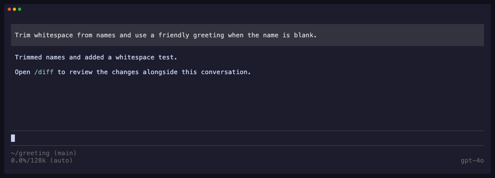

# pidiff

A live diff viewer for [Pi](https://pi.dev). Keep your conversation and prompt on the left, with changed files and syntax-colored diffs on the right.



[Watch the 29-second demo](assets/demo.mp4). Recorded in Pi with a scripted sample project.

- Watch diffs update as Pi works or files change externally.
- Resize the pane and browse files without leaving your prompt.
- Review Pi's edits by turn in a separate viewer.

## Install

```sh
pi install git:github.com/peterlimg/pidiff
```

Run `/reload`, then set **TUI mode** to **fullscreen** in `/settings`. Open a Git repository and run `/diff`.

The split pane needs at least **110 terminal columns**. Use `/diff view` for a modal viewer in regular TUI mode or a narrower terminal.

Requires Node.js 22.19+ and Git. Tested with Pi 0.85.1; older Pi versions are unsupported.

## Use

| Command | Action |
| --- | --- |
| `/diff` | Toggle the live pane showing unstaged changes |
| `/diff HEAD` | Show net staged and unstaged changes, plus untracked files |
| `/diff main` | Compare against the merge-base with `main` |
| `/diff view` | Open unstaged changes and recorded turns in the modal |
| `/diff view main` | Open the modal comparing against `main` |

By default, `/diff` works like `git diff`: staged-only and untracked files are excluded. Viewing diffs does not modify your files or index.

### Split pane

Click a filename to open its diff. Drag the divider to resize. Scroll over the file list or code independently; scrolling past a diff's end opens the next file. Click `×` or run `/diff` again to close.

| Shortcut | Action |
| --- | --- |
| Ctrl+Alt+Up / Down | Scroll code |
| Ctrl+Alt+Left / Right | Switch files |
| Ctrl+Alt+Shift+Left / Right | Resize the pane |

### Modal viewer

| Key | Action |
| --- | --- |
| Left / Right | Switch between Current and recorded turns |
| Up / Down, j / k | Select a file or scroll code |
| Enter | Open a diff |
| PageUp / PageDown | Page through files or code |
| r | Refresh Current |
| Esc, Ctrl+C, q | Go back, then close |

Turn history covers Pi's `edit` and `write` calls while pidiff is loaded. Shell and external edits appear in Current, not as recorded turns.

## License

[MIT](LICENSE)
